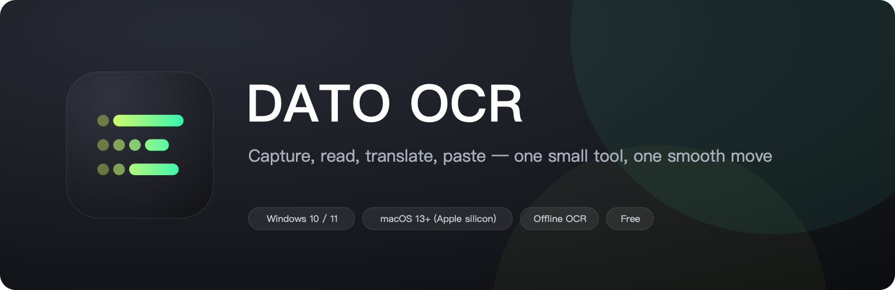
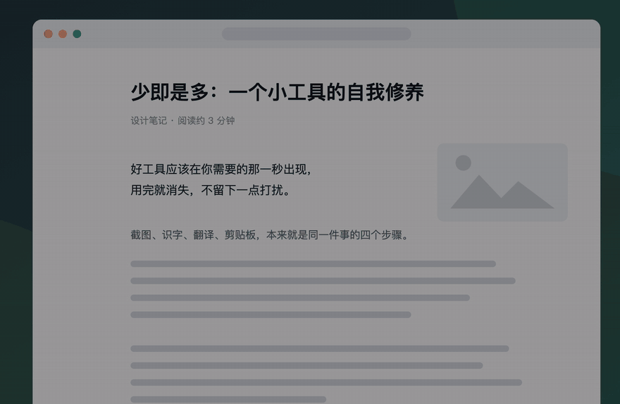
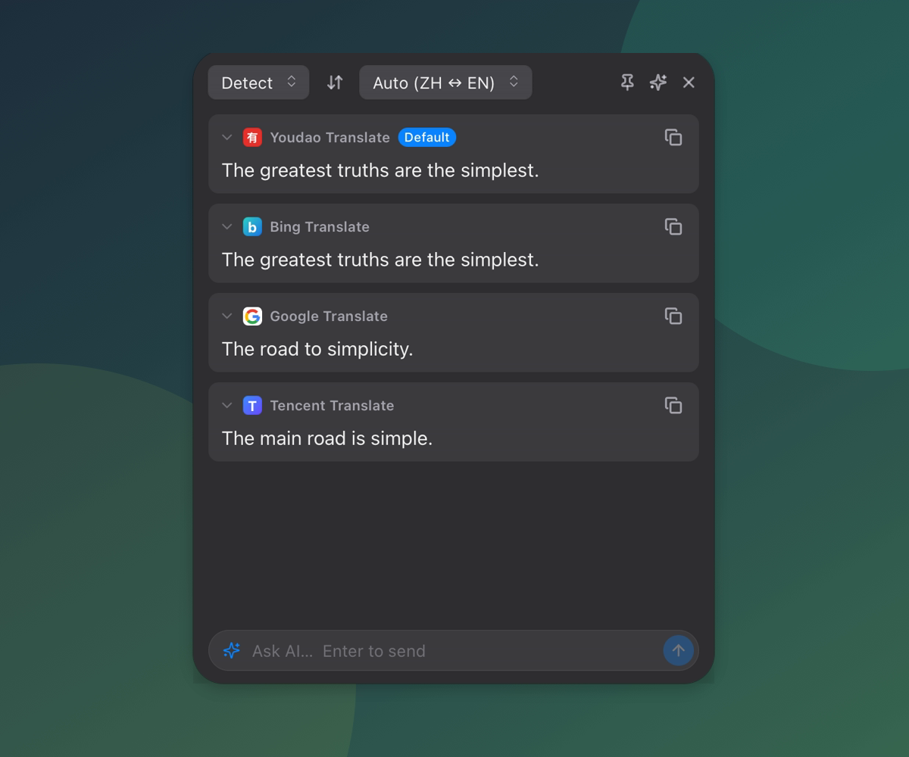
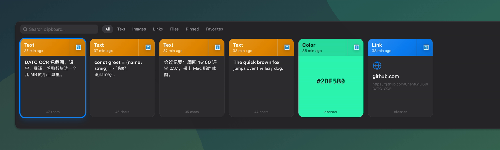
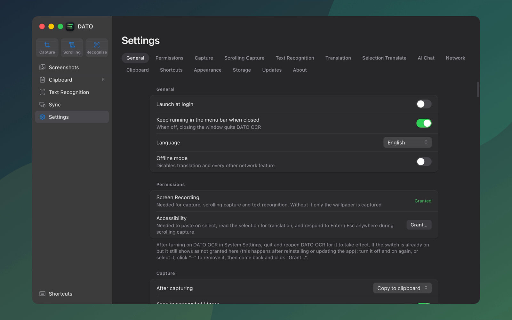

<p align="center">
  
</p>

<p align="center">
  <a href="README.md">简体中文</a> · <b>English</b>
</p>

<p align="center">
  <a href="https://github.com/Chenfugui69/DATO-OCR/releases/latest"><b>Download the latest release</b></a>
  &nbsp;·&nbsp; Windows 10 / 11 &nbsp;·&nbsp; macOS 13+ (Apple silicon) &nbsp;·&nbsp; Free
</p>

Keeping something you see on screen usually takes four steps: capture it, turn it into text, translate it, paste it somewhere.
DATO OCR makes those four steps one tool: press a key to start, and the result is already on your clipboard.

---

## Capture: select, annotate, done

<p align="center">
  
</p>

- **Select and go**: windows are detected automatically and edges snap as you drag. Copy, save, or pin the result on screen.
- **Annotate**: rectangle, ellipse, arrow, pen, mosaic, text. Everything can be moved and resized afterwards.
- **Instant capture**: grabs the whole desktop the moment you press the key, including menus and popups that vanish on touch.
- **Scrolling capture**: scroll the page and it stitches one long image.
- **Record a GIF**: select an area and record it; it is saved and copied when you finish.
- **Translate in place**: one key after capturing, and the translation appears right where the original text was.

## Recognize and translate: results as soon as you select

<p align="center">
  
</p>

- **Text recognition**: select an area and get the text, copied automatically. Fully offline; images are never uploaded.
- **Selection translate**: select text, press the shortcut or click the floating button, and several services answer side by side.
- **Free services built in**: Youdao, Bing, Tencent and Google work out of the box. You can also add your own DeepL or LLM key.
- **Ask AI**: the input box sits under the translation. Ask about the selected text, the recognized text, or the screenshot. You bring your own API address and key.

## Clipboard: everything you copied, still there

<p align="center">
  
</p>

- **Colored by type**: text, images, links, colors and files are easy to tell apart.
- **Paste on select**: open it with a shortcut, pick with the arrow keys, press Enter, and it lands in the window you were using.
- **Sync across devices**: scan a QR code on the same Wi-Fi to copy on the computer and paste on the phone, or sync through a WebDAV drive.
- **Stays on your machine**: history is never uploaded. Auto cleanup and an app blacklist are available.

## Everything is adjustable

<p align="center">
  
</p>

Selection frame color and thickness, panel style, frosted glass, every shortcut, the order of translation services — all in Settings.
The interface is available in English and Simplified Chinese and follows your system language by default.

---

## Shortcuts

| Action | Windows | macOS |
|---|---|---|
| Capture | `F1` | `⌥1` |
| Scrolling capture | `F2` | `⌥2` |
| Recognize text | `F3` | `⌥3` |
| Instant capture | `Shift+F1` | `⌥⇧1` |
| Clipboard panel | `Alt+V` | `⌥V` |
| Selection translate | `Ctrl+Alt+T` | `⌃⌥T` |
| After capturing: translate / record GIF / pin / save | `Ctrl+T` / `G` / `P` / `S` | `⌘T` / `G` / `P` / `S` |

All of them can be changed in Settings → Shortcuts.

## Download and install

Get it from the [releases page](https://github.com/Chenfugui69/DATO-OCR/releases/latest).

**Windows**: download `DATO-OCR_<version>_x64-setup.exe` and run it. New versions are announced in Settings and install with one click.

**macOS (Apple silicon)**: download the `.dmg` and drag DATO OCR into Applications.

- The first launch is blocked by the system: go to System Settings → Privacy & Security and click "Open Anyway".
- Capturing needs the Screen Recording permission; selection translate and paste-on-select need Accessibility. Settings → Permissions in the app takes you straight there. Restart the app after granting.
- The macOS version does not update itself yet; download new versions manually.

## Privacy

- Text recognition runs on your machine: the bundled offline engine on Windows, the system's own recognizer on macOS.
- Screenshots, recognition history and clipboard history are stored locally and never uploaded.
- Translation and AI chat go online and send the content to the service you chose. API keys are stored encrypted on your machine.

---

## For developers

Tauri v2 + React + TypeScript + Rust. Windows is the primary platform; the macOS port is in place, with some features not yet verified by hand.
Build instructions, debug switches, the code map and design decisions are in the [Chinese README](README.md#给开发者) and under [`docs/`](docs/) (in Chinese).

```bash
corepack pnpm install
corepack pnpm fetch-ocr      # Windows only: downloads the offline OCR engine
corepack pnpm tauri dev
```
