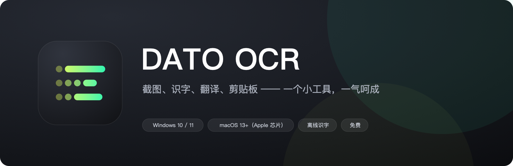
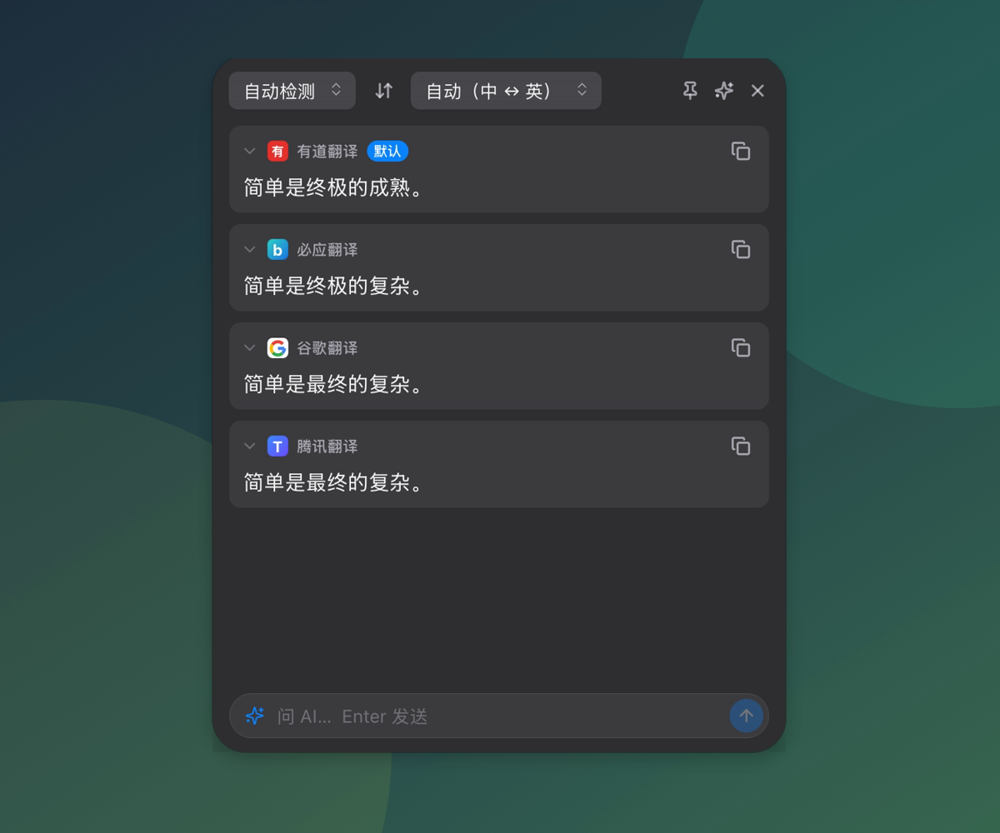
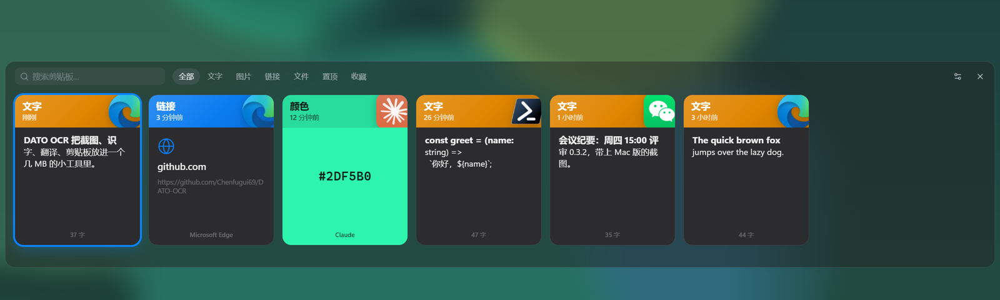
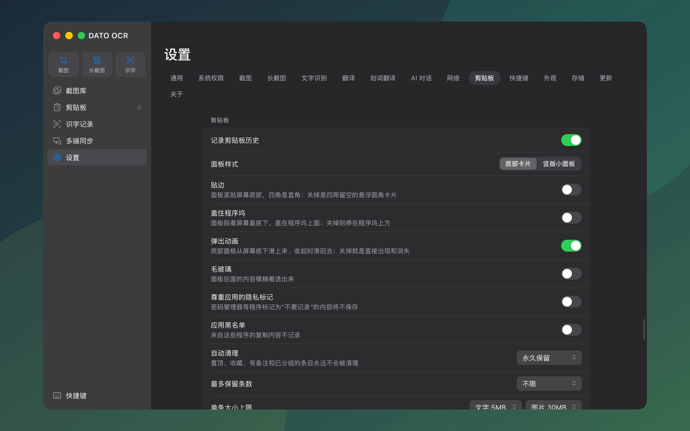

<p align="center">
  
</p>

<p align="center">
  <b>简体中文</b> · <a href="README.en.md">English</a>
</p>

<p align="center">
  <a href="https://github.com/Chenfugui69/DATO-OCR/releases/latest"><b>下载最新版</b></a>
  &nbsp;·&nbsp; Windows 10 / 11 &nbsp;·&nbsp; macOS 13+（Apple 芯片）&nbsp;·&nbsp; 免费
</p>

看到一段想留下的内容，通常要走四步：截下来、把字认出来、翻译一下、再贴到别处。
DATO OCR 把这四步做成了一个工具：按一个键开始，结果直接在剪贴板里。

---

## 截图：框选、标注，一步到位

<p align="center">
  
</p>

- **框一下就能用**：自动识别窗口边界，拖边缘会吸附；框完直接复制、保存，或者钉在屏幕上当贴图。
- **标注**：矩形、椭圆、箭头、画笔、马赛克、文字。画完还能拖动、改大小。
- **瞬间截屏**：按下就抓整个桌面，一碰就消失的菜单和弹窗也截得到。
- **长截图**：滚动页面，自动拼接成一张长图。
- **录 GIF**：框好区域直接录成动图，录完自动保存并复制。
- **原位翻译**：截图后一键翻译，译文直接写在图片原来的位置。

## 识字和翻译：选中就有结果

<p align="center">
  
</p>

- **截图识字**：框选后直接出文字，识别完自动复制。完全离线，图片不会上传。
- **划词翻译**：选中文字，按快捷键或点一下悬浮按钮，几个翻译源的结果同时列出来。
- **内置免费翻译源**：有道、必应、腾讯、谷歌，开箱即用；也可以填自己的 DeepL 或大模型密钥。
- **直接问 AI**：翻译面板底下就是输入框，带着选中的文字、识字结果或截图提问。接口和密钥由你自己填。

## 剪贴板：复制过的都找得回来

<p align="center">
  
</p>

- **按内容类型上色**：文字、图片、链接、颜色、文件，一眼分清。
- **选中即粘贴**：按快捷键呼出，方向键选中、回车就贴到刚才的窗口里。
- **多端同步**：同一个 Wi-Fi 下扫码就能连，电脑上复制、手机上粘贴；也能用坚果云等网盘同步。
- **只存在本机**：历史记录不上传，可以设置自动清理、应用黑名单。

## 一切都可以调

<p align="center">
  
</p>

选区框的颜色和粗细、面板样式、毛玻璃、每一个快捷键、翻译源的顺序，都在设置里。
界面有简体中文和英文，默认跟随系统语言。

---

## 快捷键

| 功能 | Windows | macOS |
|---|---|---|
| 截图 | `F1` | `⌥1` |
| 长截图 | `F2` | `⌥2` |
| 截图识字 | `F3` | `⌥3` |
| 瞬间截屏 | `Shift+F1` | `⌥⇧1` |
| 剪贴板面板 | `Alt+V` | `⌥V` |
| 划词翻译 | `Ctrl+Alt+T` | `⌃⌥T` |
| 截图后：翻译 / 录 GIF / 贴图 / 保存 | `Ctrl+T` / `G` / `P` / `S` | `⌘T` / `G` / `P` / `S` |

全部可以在「设置 → 快捷键」里改。

## 下载和安装

到 [发行版页面](https://github.com/Chenfugui69/DATO-OCR/releases/latest) 下载。

**Windows**：下载 `DATO-OCR_<版本>_x64-setup.exe`，双击安装。之后有新版本会在设置里提示，一键升级。

**macOS（Apple 芯片）**：下载 `.dmg`，把 DATO OCR 拖进"应用程序"。

- 首次打开会被系统拦下：到「系统设置 → 隐私与安全性」点「仍要打开」。
- 截图需要「屏幕录制」权限，划词翻译和选中即粘贴需要「辅助功能」权限。应用的「设置 → 系统权限」里可以直接跳过去授权，给完重启应用。
- Mac 版暂时没有自动更新，新版本需要手动下载。

## 隐私

- 识字在本机完成：Windows 用随包的离线引擎，macOS 用系统自带的识别。
- 截图、识字记录、剪贴板历史只存在本机，不上传。
- 翻译和 AI 对话会联网，内容发给你选的那个服务。密钥加密保存在本机。

---

# 给开发者

Tauri v2 + React + TypeScript + Rust。Windows 是主平台；macOS 版已移植，部分功能还没有真人逐项验证。

## 开发

### 环境要求

- Node 20+（自带 corepack，不需要全局装 pnpm；版本锁在 `package.json` 的 `packageManager`）
- Rust 1.82+（Windows 上用 MSVC 工具链）
- Windows 10 2004+（`WDA_EXCLUDEFROMCAPTURE` 和 WGC 抓屏都要求这个版本）
- 或 macOS 13+，装了 Xcode 或命令行工具。**项目别放在 exFAT / FAT 的盘上编译**，至少编译产物不能
  （原因和绕法见交接文档 9.4）

### 第一次拉下代码

```bash
corepack pnpm install
corepack pnpm fetch-ocr      # 下载识字引擎 RapidOCR-json 到 src-tauri/resources/ocr/（约 32MB，不入库）
```

`fetch-ocr` 会校验每个文件的 SHA-256；GitHub 慢的话用环境变量 `CHENOCR_OCR_URL` 指向镜像。
**不先跑它，`tauri build` 会因为找不到资源目录而失败**，`tauri dev` 下识字会退回系统 OCR。
macOS 不用跑 `fetch-ocr`：识字用系统自带的 Vision，包里不带引擎。

### 日常

```bash
corepack pnpm tauri dev      # 开发（Vite 1420 端口 + 调试版 Rust）
corepack pnpm tauri build    # Windows 出 NSIS 安装包：src-tauri/target/release/bundle/nsis/
corepack pnpm build:mac      # macOS 出 .app：…/release/bundle/macos/DATO OCR.app
                             # 比直接 tauri build 多一步本机签名：不然每打一次包，系统授权就要重给一遍（交接文档 9.4）
```

### 发版（检查更新用）

```bash
node scripts/release.mjs     # 打包 → 用更新私钥签名 → 生成 update/latest.json（国外）和 latest-cn.json（国内）
```

发版前把三处版本号（`package.json`、`src-tauri/Cargo.toml`、`src-tauri/tauri.conf.json`）改成新版本，
写好 `update/notes/<版本>.json`（给不懂技术的用户看的更新简介）。签名私钥在 `~/.tauri/dato-cor-updater.key`，
**丢了就没法再发能自动更新的版本**，务必备份；它不在仓库里。脚本跑完照着提示：先把安装包传到 GitHub 和 Gitee
的发行版（标签 `v<版本>`），再提交推送 `update/` 下的两份清单。详见 [`update/README.md`](update/README.md)。

### 测试与检查

```bash
corepack pnpm test                                        # 前端：选区几何与坐标换算
corepack pnpm lint                                        # ESLint（类型感知）
cargo test  --manifest-path src-tauri/Cargo.toml          # Rust：拼接算法、分词、排版还原、设置迁移……
cargo clippy --manifest-path src-tauri/Cargo.toml --all-targets
```

抓屏、识字引擎这类要真机的测试默认跳过，手动跑：

```bash
cargo test --manifest-path src-tauri/Cargo.toml -- --ignored --nocapture
```

### 调试开关

- `CHENOCR_ALLOW_SELF_CAPTURE=1`：让 DATO OCR 自己的窗口（遮罩、面板、气泡、贴图）能被截图工具拍到。
  正常情况下它们都设了 `WDA_EXCLUDEFROMCAPTURE`，外部截图只能拍到一片空白，自动化测试时要开这个。
- `CHENOCR_TEST_NO_CLIPBOARD=1`：录 GIF 后不把文件放进剪贴板（自动化测试时用）。
- `CHENOCR_TEST_DATA_DIR=目录`：数据（设置、数据库、图片）放到这个目录下，不碰真正的历史。
- `CHENOCR_TEST_SYNC_LOOPBACK=1`：局域网同步服务只绑 127.0.0.1（不触发防火墙询问）、不做 mDNS 广播、加入申请自动同意。
  只绑回环时只有本机程序连得上，所以自动同意不会放外人进来。
- `CHENOCR_TEST_UPDATE_URL=http://127.0.0.1:端口/latest.json`：检查更新只查这个地址（允许 http），启动 3 秒后就查。
- `CHENOCR_TEST_UPDATE_NO_INSTALL=1`：点"更新"只下载、验签，不运行安装包、不退出。
- 日志在 `%APPDATA%\DATO OCR\logs\`（macOS：`~/Library/Application Support/DATO OCR/logs/`），开发模式同时打到终端。前端未捕获的错误也会转进日志。
- `chenocr --action=capture`（还有 `instant` / `longshot` / `ocr` / `clipboard` / `translate` / `ai` / `cancel`）：
  让已经在跑的实例直接执行一个功能，等同按热键。脚本和自动化测试用。
- 调试版另有 `--eval=窗口标签:脚本.js`（在页面里执行脚本）和 `CHENOCR_FAKE_MONITOR`（假装多一块屏），
  macOS 上量遮罩流畅度用 `scripts/test/mac-overlay-bench.sh`，见交接文档 9.5。

## 代码结构

```
src/                          前端（React 18 + TypeScript）
  views/<窗口>/               每个窗口一个目录；所有窗口共用 index.html，按窗口 label 选视图
  views/annotate/             标注引擎（截图遮罩和编辑窗口共用）
  ui/                         基础控件（基于 Radix 原语，自绘 Apple 风格）
  lib/ipc.ts                  所有 Rust 命令的类型化封装
src-tauri/src/                后端（Rust）
  platform/                   唯一允许出现平台相关代码的地方（windows/ 和 macos/ 两套实现）
  capture/ longshot/ ocr/ translate/ clipboard/ …   各功能模块，与规格文档一一对应
  storage/                    SQLite（截图库、识字记录、剪贴板、加密的密钥）
scripts/fetch-ocr.mjs         下载识字引擎
scripts/test/                 真机测试用的 PowerShell 小工具（模拟键鼠、截屏、测试目标窗口），见交接文档第 7 节
```

数据都在 `%APPDATA%\DATO OCR\`（macOS：`~/Library/Application Support/DATO OCR/`）：`chenocr.db`、`screenshots/`、`clipboard/`、`ocr/`、`logs/`、`settings.json`。

## 核心决策速查

| 项 | 结论 |
|---|---|
| 技术框架 | Tauri v2 + React + TypeScript |
| 截图交互 | 对齐微信 Windows 版手感 |
| 界面风格 | Apple 设计语言，外框用系统原生材质（Windows 的 Mica / 亚克力，macOS 的毛玻璃） |
| 文字识别 | Windows：RapidOCR-json 离线（随包约 32MB），失败时退回系统 OCR；macOS：系统自带的 Vision |
| 翻译 | 内置免费源（必应、腾讯、谷歌）+ 可自填 DeepL / OpenAI 兼容密钥；用户排序，第一个是默认源；可走系统 / 自定义代理 |
| 长截图 | 只做手动滚动，自动拼接 |
| 剪贴板 | 默认全量记录，本地存储，底部横向卡片面板 |
| AI 对话 | OpenAI 兼容 / Anthropic 接口，用户自填地址和密钥，密钥加密保存（Windows DPAPI；macOS 钥匙串里的主密钥） |
| 依赖许可 | 只用与 GPL-3.0 兼容的协议（MIT / Apache-2.0 / BSD / MPL-2.0 / GPL-3.0），不引入 AGPL |
| 开源协议 | GPL-3.0，免费 |

## 许可证

DATO OCR 以 [GNU 通用公共许可证第 3 版（GPL-3.0）](LICENSE) 发布：可以自由使用、修改、再分发，但分发修改后的版本时也必须以 GPL-3.0 公开源代码。
